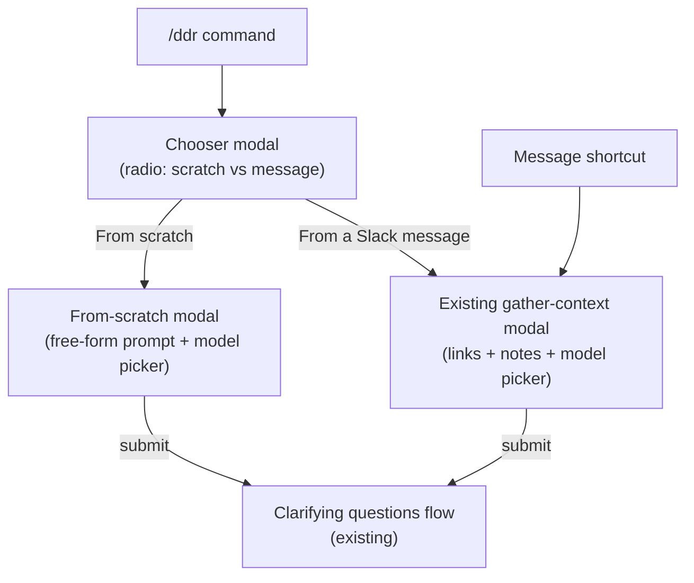

# `/ddr` Slash Command: Chooser + From-Scratch Flow

All changes are in [app.js](app.js).

## Architecture

## Step 1: Chooser modal from `/ddr`

Replace the current `app.command("ddr", ...)` handler (lines 126-161) so it opens a **new chooser modal** instead of going straight to the gather-context modal.

- The chooser modal has a single `radio_buttons` element with two options: **"Start from scratch"** and **"From a Slack message"**.
- `callback_id`: `"ddr_chooser_submit"`
- `private_metadata`: JSON-encode `{ channelId, userId, initiatedBy, sessionId }` so we can reconstruct the session on submit. No session is created yet.

## Step 2: Handle chooser submission

Add `app.view("ddr_chooser_submit", ...)`:

- Read the selected radio value from `view.state.values`.
- Create a session in the `sessions` Map (same shape as today).
- **If "from_scratch"**: set `session.sourceMessages` to an empty string, and respond with `response_action: "update"` to push a **new "from scratch" modal** (see Step 3).
- **If "from_message"**: set `session.sourceMessages` to a placeholder, and respond with `response_action: "update"` to push the existing `buildGatherContextModal(...)` (no captured conversation, user pastes links/notes).

## Step 3: Build the "from scratch" modal

Add a new function `buildFromScratchModal(sessionId, selectedModel)` that returns a modal with:

- A multi-line `plain_text_input` (block `"scratch_prompt"`, action `"prompt_input"`) with placeholder like "Describe the design decision, problem, and context..."
- The same external-select model picker (`model_select` / `model_choice`) already used in the gather-context modal.
- `callback_id`: `"scratch_prompt_submit"`
- `private_metadata`: `sessionId`

## Step 4: Handle "from scratch" submission

Add `app.view("scratch_prompt_submit", ...)`:

- Read the prompt text from `view.state.values.scratch_prompt.prompt_input.value`.
- Read the selected model from `view.state.values.model_select.model_choice`.
- Store the prompt as `session.sourceMessages` (the same field the shortcut path uses for thread text) and `session.selectedModel`.
- From here, continue into the **existing clarifying-questions flow**: ack with `buildClarifyingLoadingModal`, start loading updates, generate clarifying questions, update to `buildClarifyingQuestionsModal`. This is the same logic currently in `gather_context_submit` (lines 287-390) -- extract the shared part into a helper or duplicate the small block.

## Step 5: Adjust `synthesizeDecision` context label

In `synthesizeDecision` (line 655), the context block is labeled `"--- Original Thread/Message ---"`. When the session came from scratch, this label should say something like `"--- User-Provided Context ---"` instead. Use a simple conditional on `session.sourceMessageTs` (null for scratch/command sessions, set for shortcut sessions).

## Summary of new functions/handlers

| Item                                | Type     | Purpose                                            |
| ----------------------------------- | -------- | -------------------------------------------------- |
| `buildDdrChooserModal`              | function | Radio buttons: scratch vs message                  |
| `app.view("ddr_chooser_submit")`    | handler  | Routes to scratch modal or gather-context modal    |
| `buildFromScratchModal`             | function | Free-form prompt + model picker                    |
| `app.view("scratch_prompt_submit")` | handler  | Takes prompt, feeds into clarifying-questions flow |

No new scopes, no changes to the message shortcut path.